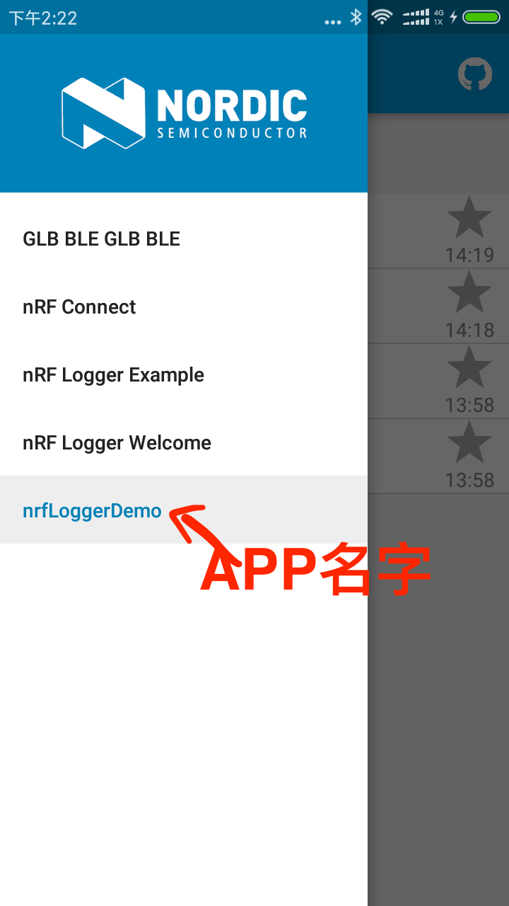
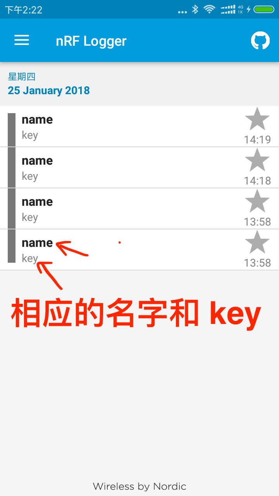
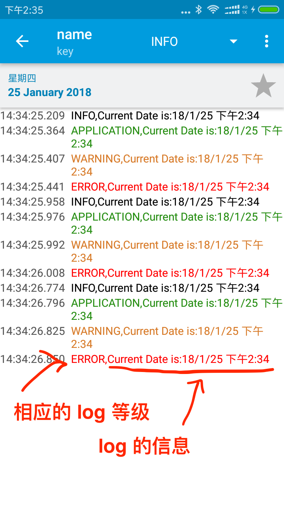

# nrf Logger 的简单的应用 Demo

### 参考:
* 1.https://github.com/NordicSemiconductor/nRF-Logger-API
* 2.https://github.com/ghzjtian/nrfLogger


### 用法:
>nRF Logger is available for Android 4.1.* and newer.

##### 1.在 APP 的 build.gradle 中引入 library.

```

dependencies {

    compile 'no.nordicsemi.android:log:2.1.1'
}

```

##### 2.在 AndroidManifest.xml 中添加一下的信息.

```
    <uses-permission android:name="no.nordicsemi.android.LOG" />
```
```
 <provider
            android:name="com.example.tianzeng.testnrflogger.localprovider.MyLogContentProvider"
            android:authorities="no.nordicsemi.android.log.example"
            android:exported="false" />
```

##### 3.提供一个 LocalLogContentProvider(AUTHORITY 要唯一， AndroidManifest 中的 android:authorities 一致.) 类.

```
package localprovider;

import android.net.Uri;

import no.nordicsemi.android.log.localprovider.LocalLogContentProvider;


public class MyLogContentProvider extends LocalLogContentProvider {
	/** The authority for the contacts provider. */
	public static final String AUTHORITY = "no.nordicsemi.android.log.example";
	/** A content:// style uri to the authority for the log provider. */
	public static final Uri AUTHORITY_URI = Uri.parse("content://" + AUTHORITY);

	@Override
	protected Uri getAuthorityUri() {
		return AUTHORITY_URI;
	}

}

```

##### 4.检查是否安装了 nrf Logger .

```
// Show information if nRF Logger is not installed
        if (!logProviderExists()) {
            Toast.makeText(this,"nRF Logger is not installed. Using local log.", Toast.LENGTH_SHORT).show();
        }

 private boolean logProviderExists() {
                // The method below requires API 16
                final ContentProviderClient unstableClient = getContentResolver().acquireUnstableContentProviderClient(LogContract.AUTHORITY);
                if (unstableClient == null)
                    return false;

                unstableClient.release();
                return true;
            }

```

##### 5.在开始的 Activity 设置 Logger.

```
ILogSession mLogSession = Logger.newSession(getActivity(), "key", "name");
```

##### 6.记录的 Log.

```java
                          String dateTime = sdf.format(new Date());

                          int level = Level.INFO;
          //                level = Level.VERBOSE;
          //                level = Level.DEBUG;
          //                level = Level.INFO;
          //                level = Level.APPLICATION;
          //                level = Level.WARNING;
          //                level = Level.ERROR;


                          Logger.log(mLogSession, level, "Current Date is:" + dateTime);
```

##### 7.在 APP 退出时，注销 logger session

```
@Override
	public void onDestroy() {
		try {
			// Let's delete the local log session when exit
			if (mLogSession != null) {
				LocalLogSession session = (LocalLogSession) mLogSession;
				session.delete();
			}
		} catch (ClassCastException e) {
			// do nothing, nRF Logger is installed
		}
		super.onDestroy();
	}
```


***

### 相应的 截图






